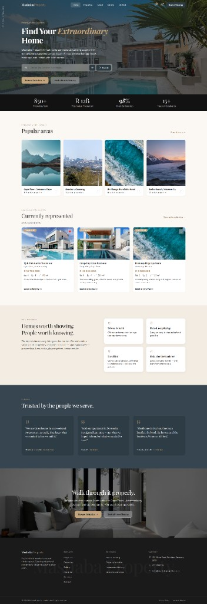
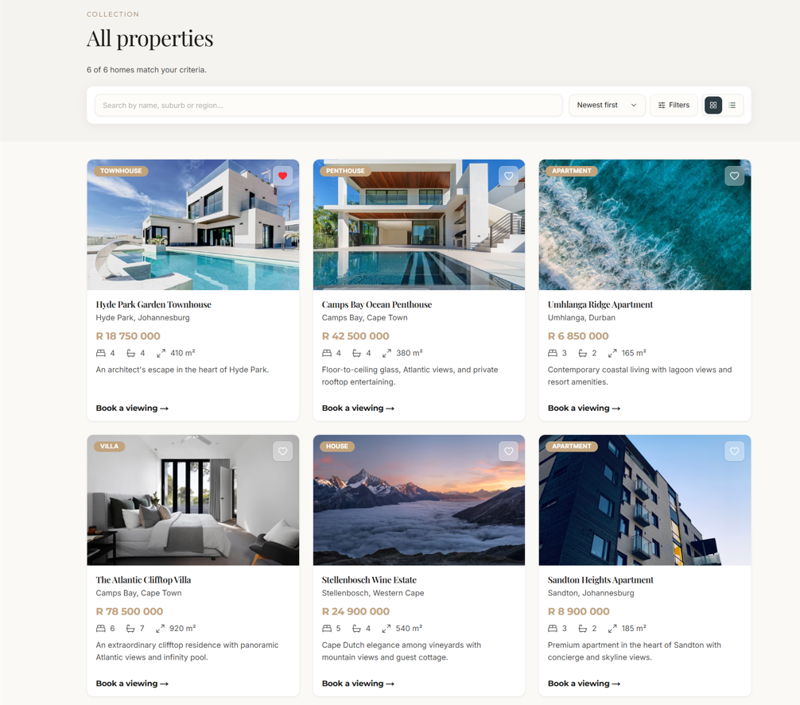
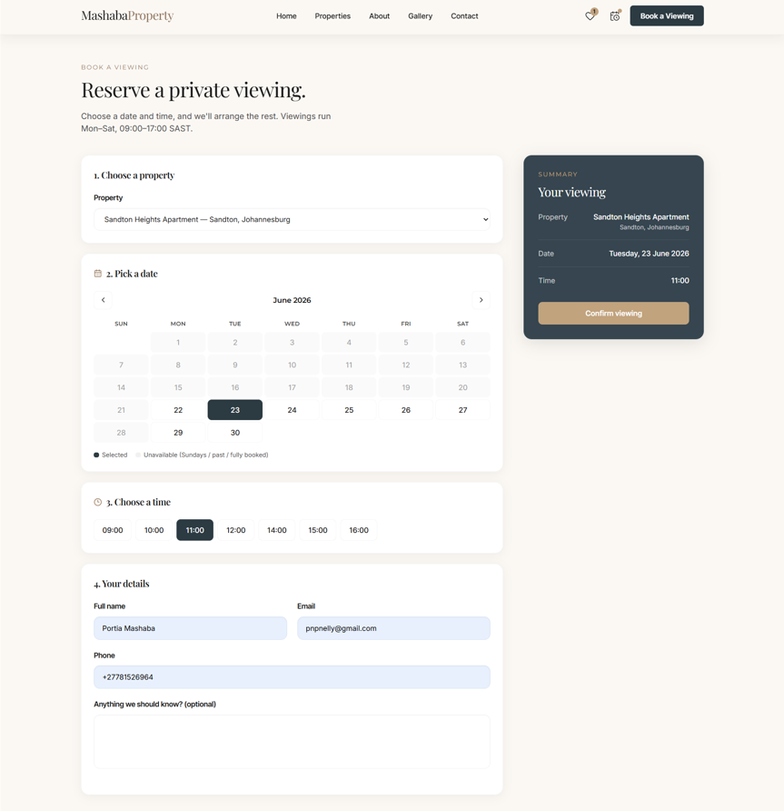
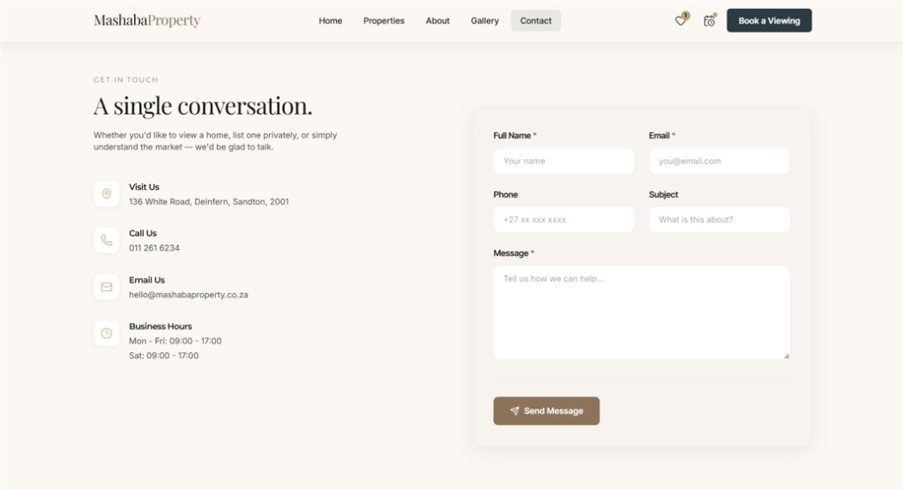
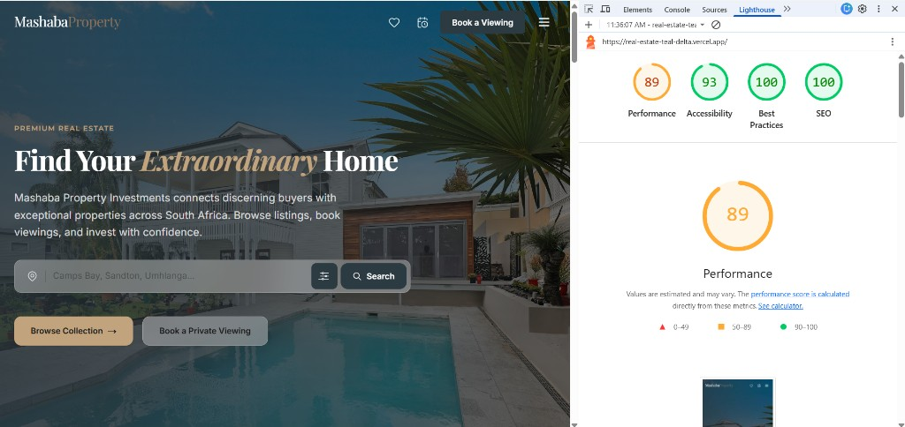
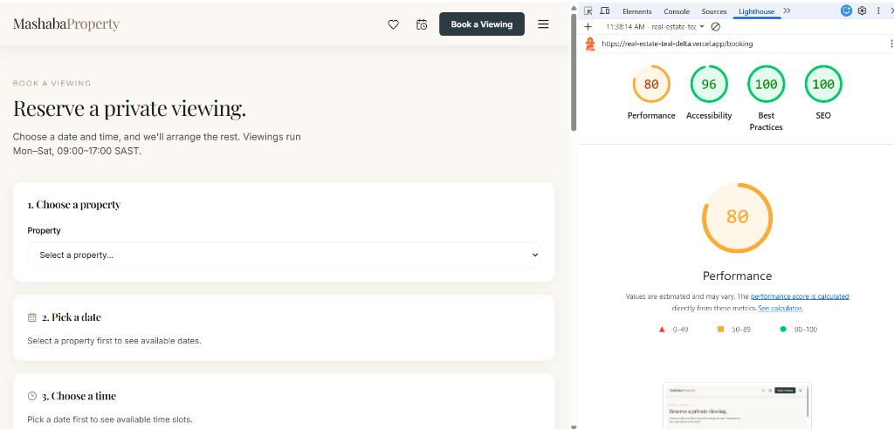
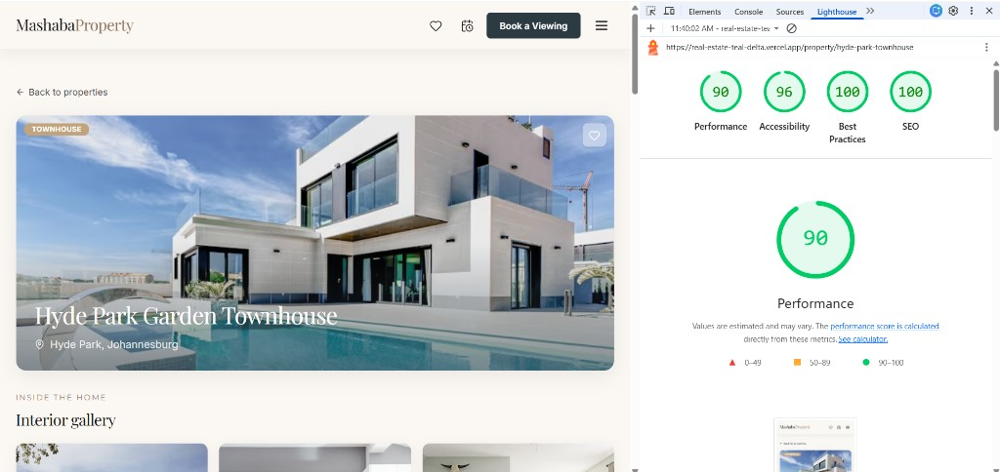

# Mashaba Property Investments

Real estate site for **Mashaba Property Investments** — a small Sandton agency (est. 2024) with six listings across Cape Town, Johannesburg, Durban, and the Winelands. Built for the CommunityBytes web developer assessment.

**Live:** [real-estate-teal-delta.vercel.app](https://real-estate-teal-delta.vercel.app)  
**Repo:** [github.com/Portia-Nelly-Mashaba/Real-Estate](https://github.com/Portia-Nelly-Mashaba/Real-Estate)



---

## What it does

- Property listings with search, filters, grid/list view, and detail pages
- Book a viewing (calendar, time slots, form, confirmation, WhatsApp handoff)
- Favourites saved in the browser
- Contact form, photo gallery, about/services, privacy and terms
- Deployed on Vercel with sitemap, metadata, and Lighthouse-friendly setup

---

## Tech stack

Next.js 16 · TypeScript · React 19 · Tailwind CSS 4 · Lucide icons · Vercel

---

## Run locally

```bash
git clone https://github.com/Portia-Nelly-Mashaba/Real-Estate.git
cd Real-Estate
npm install
cp .env.example .env.local
npm run dev
```

Set `NEXT_PUBLIC_SITE_URL` in `.env.local` (no trailing slash). On Vercel, use your production URL.

```bash
npm run build   # production build
npm run lint    # eslint
```

---

## Screenshots

| Page | |
|------|---|
| Properties |  |
| Booking |  |
| Contact |  |

---

## Lighthouse (mobile, live site)

| Page | Perf | A11y | Best | SEO |
|------|------|------|------|-----|
| [Home](https://real-estate-teal-delta.vercel.app/) | 89 | 93 | 100 | 100 |
| [Booking](https://real-estate-teal-delta.vercel.app/booking) | 80 | 96 | 100 | 100 |
| [Property](https://real-estate-teal-delta.vercel.app/property/hyde-park-townhouse) | 90 | 96 | 100 | 100 |







---

## Author

**Portia Nelly Mashaba** · CommunityBytes assessment, June 2026
